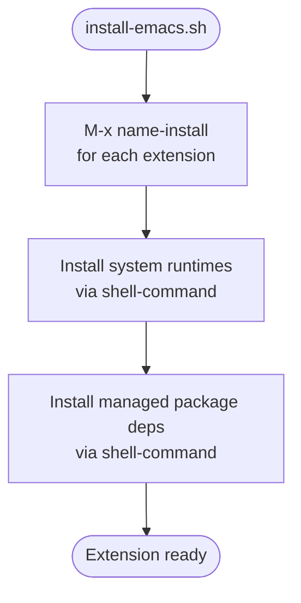

# Extension Reference Architecture

## Goal

Define a self-contained structure for each custom Emacs extension in this repository.
Each extension owns its full dependency and bootstrap story within its `.el` file,
making it portable and decoupled from the parent project by design — not as a secondary
workflow, but as a natural consequence of where logic lives.

---

## Rationale

| Approach | Single source of truth | Portable by default |
|---|---|---|
| Bootstrap in `install.sh` | No — logic split across shell and Elisp | No — shell script must travel with `.el` |
| Bootstrap in `.el` | Yes — one file owns everything | Yes — `.el` alone is sufficient |

Emacs Lisp is a general-purpose language capable of invoking shell commands. There is no
reason to maintain a separate shell script. The `.el` file is the sole artifact required
to install, configure, and operate an extension.

---

## Constraints

- Each extension lives in its own subdirectory under `lisp/extensions/`
- All bootstrap logic lives in the `.el`; no shell scripts are authored per extension
- The `.el` must not reference any path outside its own directory
- `M-x <name>-install` is the single bootstrap command; it is idempotent
- Runtime dependency checks on load are non-fatal; missing deps surface as warnings
  directing the user to `M-x <name>-install`
- On command invocation with deps absent, a user-facing error directs the user to
  `M-x <name>-install`
- All `.el` files use lexical binding (`;;; -*- lexical-binding: t; -*-`)
- Each extension ends with `(provide 'extension-name)`
- Each extension has a paired ERT test file under `tests/`

---

## Diagram



---

## Outline

### 1. Directory Layout

Each extension is a subdirectory of `lisp/extensions/`. Required files:

```
lisp/extensions/<name>/
├── <name>.el            # the extension; owns all logic including bootstrap
└── tests/
    └── <name>-test.el   # ERT tests
```

Optional files, present only when the extension has managed package dependencies:

```
    ├── package.json     # pinned dependency versions
    └── bun.lockb        # committed lockfile for reproducible installs
```

The parent repo keeps internal design documents in `docs/<name>-spec.md`. That file
is not part of the extension.

### 2. Dependency Declaration

Each spec includes a `## Dependencies` section listing:

- **System runtimes** — tools installed at the OS level (e.g. Bun via Homebrew),
  invoked via `shell-command` inside `M-x <name>-install`
- **Managed packages** — versioned dependencies declared in `package.json`, installed
  via `shell-command` inside `M-x <name>-install`; lockfile committed for reproducibility
- **Emacs packages** — declared via `Package-Requires` in the `.el` header

### 3. Bootstrap

`install-emacs.sh` calls `M-x <name>-install` for each extension via batch Emacs.
`M-x <name>-install` uses `shell-command` to install system runtimes and resolve
managed package dependencies. That is the entire install story.

### 4. Runtime Dependency Checks

The `.el` performs two levels of checking:

- **On load** — verify required binaries are on `exec-path`. If absent, emit a
  `display-warning` directing the user to `M-x <name>-install`. Never signal an
  error at load time.
- **On command invocation** — re-check immediately before executing. Signal a
  user-facing error directing the user to `M-x <name>-install` if deps are absent.

### 5. Configuration

Each extension exposes a `defcustom` group named after the extension. At minimum:

- Paths to any required external binaries (default: resolved from `exec-path`)
- Any timeout or output format options relevant to the extension

Defaults must work without manual configuration after running `M-x <name>-install`.

### 6. Linting and Formatting

All quality checks use tools built into Emacs. No third-party linters or formatters
are introduced as dependencies. `check.sh` at the repo root enforces all checks and
exits non-zero on any failure — suitable for CI.

```bash
./check.sh
```

The script runs four checks in order across every extension:

| Step | Tool | Effect |
|---|---|---|
| Format | `indent-region` | Rewrites indentation in place |
| Byte-compile | `batch-byte-compile` | Catches undefined vars, wrong-arity calls, syntax errors |
| Checkdoc | `checkdoc-file` | Validates docstring presence and style |
| ERT | `ert-run-tests-batch-and-exit` | Runs the paired test suite |

### 7. Testing

ERT tests live in `tests/<name>-test.el`. Tests cover block detection, output
parsing, error handling, and display logic. Subprocess calls are mocked; tests must
not require the external runtime to be present. Run the suite with:

```bash
emacs --batch -l <name>.el -l tests/<name>-test.el -f ert-run-tests-batch-and-exit
```
