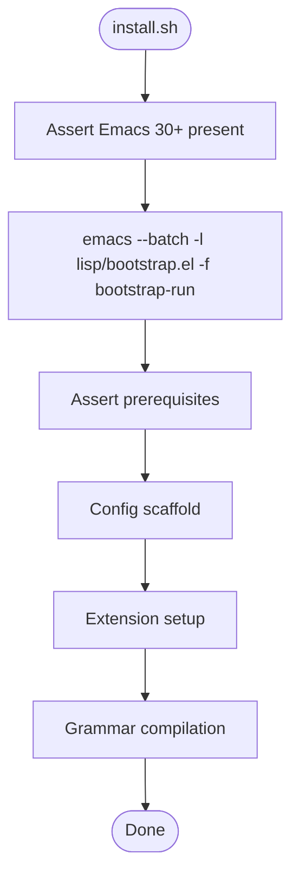
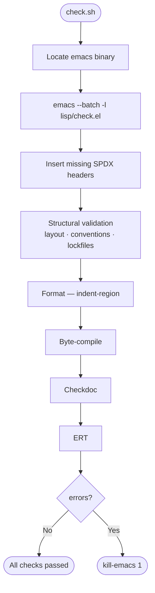

# Headless Elisp Tooling — Specification

## Goal

Replace the shell logic in `install.sh` and `check.sh` with two Emacs Lisp
files — `lisp/bootstrap.el` and `lisp/check.el` — invoked headlessly via
`emacs --batch`. Shell scripts retain only what Emacs cannot do: asserting that
Emacs is installed and meets the version requirement.

---

## Rationale

| Logic | Currently | After migration |
|---|---|---|
| Config scaffold (dirs, symlinks, .gitignore, git init) | Bash + `ln`, `mkdir`, `git` | `make-directory`, `make-symbolic-link`, `write-region`, `call-process` |
| Extension bootstrap (install loop) | Shell `find` loop calling `emacs --batch` per extension | Single `emacs --batch -l bootstrap.el` pass |
| Tree-sitter grammar compilation | Inline `--eval` slab in shell | Standalone Elisp function in `bootstrap.el` |
| SPDX header insertion | `grep` + `sed -i ''` | `find-file`, `goto-char`, `insert`, `save-buffer` |
| Structural validation | Shell `find` loop + string tests | `directory-files`, `file-exists-p`, string predicates |
| Format / byte-compile / checkdoc / ERT | Shell loop invoking `emacs --batch` per extension per check | Single Elisp pass over all extensions |

Shell is the right tool for bootstrapping the OS-level toolchain. It is a poor fit
for everything else: each `emacs --batch` subprocess spawned from a loop pays a
cold-start penalty, and the Emacs APIs for file I/O, string processing, and process
invocation are directly available once Emacs exists.

---

## Constraints

- `install.sh` retains exactly one responsibility: asserting that Emacs 30+ is
  installed and invoking `bootstrap.el`. System prerequisites (Xcode CLT,
  Homebrew, tree-sitter) are documented requirements asserted by `bootstrap.el`,
  not installed by either script. Everything else moves to `bootstrap.el`.
- `check.sh` retains exactly one responsibility: locating the Emacs binary and
  exec'ing `emacs --batch -l lisp/check.el`. All check logic moves to `check.el`.
- Both `.el` files use lexical binding and end with `(provide ...)`.
- Both `.el` files must pass `check.sh` (byte-compile, checkdoc, ERT).
- `bootstrap.el` and `check.el` are not extensions; they live directly in `lisp/`,
  not under `lisp/extensions/`.
- Error reporting in both files uses `message` to stderr (the default in batch
  mode). Exit status is communicated via `(kill-emacs N)`.
- `bootstrap.el` is idempotent: safe to re-run after the initial install.
- `check.el` is read-only with respect to production code, except for the SPDX
  insertion step which intentionally mutates source files.
- No new external tools are introduced. All Emacs APIs used must be available in
  GNU Emacs 30.

---

## Diagrams

### Install path



### Check path



---

## Outline

### 1. `lisp/bootstrap.el`

Invoked by `install.sh` as:

```bash
"$EMACS_BIN" --batch -l "${SCRIPT_DIR}/lisp/bootstrap.el" -f bootstrap-run
```

The file is self-contained: it derives all paths relative to its own location via
`(file-name-directory (or load-file-name buffer-file-name))`.

#### 1.1 Feature verification

Assert `(treesit-available-p)`. On failure, emit a warning message and exit with a
non-zero status rather than silently continuing.

#### 1.2 Config scaffold

Create the directory structure under `user-emacs-directory`:

```
<user-emacs-directory>/
├── backups/
└── auto-saves/
```

Symlink files and the `lisp/` directory using `make-symbolic-link`. Follow the same
idempotency rules as the current `link_file` / `link_dir` shell functions:

- If the symlink already points to the correct target: skip.
- If a symlink exists but points elsewhere: replace it.
- If a real file/directory exists where a symlink is expected: warn and skip (do not
  destroy user data).

Write `.gitignore` only if it does not already exist. Initialize the git repo in
`user-emacs-directory` only if `.git/` is absent, using `call-process`.

#### 1.3 Extension bootstrap

Enumerate subdirectories of `lisp/extensions/` using `directory-files`. Skip `skel`.
For each extension directory, verify `<name>.el` exists, then call `M-x <name>-install`
by loading the file and `funcall`ing the install symbol. Log progress with `message`.

#### 1.4 Tree-sitter grammar compilation

Define `treesit-language-source-alist` and iterate with `treesit-install-language-grammar`,
skipping languages for which a grammar is already available. Catch errors per language
and report per-language success or failure via `message`.

#### 1.5 Error accumulation

Accumulate errors across all steps. Exit with `(kill-emacs 1)` if any step produced
an error, so `install.sh` can detect failure and surface it.

---

### 2. `lisp/check.el`

Invoked by `check.sh` as:

```bash
"$EMACS_BIN" --batch -l "${SCRIPT_DIR}/lisp/check.el" -f check-run
```

Derives the repo root from its own file path. Accumulates an error count and calls
`(kill-emacs 1)` at the end if `errors > 0`.

#### 2.1 Source file discovery

Collect all `.el` and `.sh` files under the repo root, excluding `node_modules/`,
`.git/`, and `vendor/` paths. Use `directory-files-recursively` with a filter
predicate.

#### 2.2 SPDX header insertion

For each source file, check for the presence of `SPDX-License-Identifier:` and
`SPDX-FileCopyrightText:` lines. If absent, read the file into a `with-temp-buffer`
via `insert-file-contents`, insert the missing lines immediately after line 1
(preserving shebang lines), and write back with `write-region`. Avoids activating
any major mode (no `find-file-noselect`). Use the comment syntax appropriate to the
file type (`;; ` for `.el`, `# ` for `.sh`).

#### 2.3 Extension discovery

Enumerate valid extensions using the same criteria as `check.sh` section 2:
subdirectory of `lisp/extensions/` (excluding `skel`), with both `<name>.el` and
`tests/<name>-test.el` present. Collect passing names into a list; log structural
failures as errors.

Structural checks per extension:
- `<name>.el` exists
- `tests/<name>-test.el` exists
- Line 1 of `<name>.el` contains `lexical-binding: t`
- `(provide '<name>)` form is present
- `(defun <name>-install` form is present
- If `package.json` is present, `bun.lock` must also be present

#### 2.4 Format

For each valid extension, open `<name>.el` with `find-file-noselect`, call
`indent-region` over the full buffer, and `save-buffer`.

#### 2.5 Byte-compile

Call `byte-compile-file` on each `<name>.el`. Capture warnings by temporarily
binding `byte-compile-warnings`. Delete the resulting `.elc` file after the check.
Record errors if `byte-compile-file` returns `nil` or warnings are emitted.

#### 2.6 Checkdoc

Call `checkdoc-file` on each `<name>.el`. Capture output; treat any non-empty
output as a failure.

#### 2.7 ERT

Always run `bootstrap-test.el` and `check-test.el` against their respective source
files. Then, for each valid extension, load `<name>.el` and `tests/<name>-test.el`.
All suites run in isolated subprocesses (`emacs --batch`). Parse the exit code;
non-zero is a failure. Capture and display the last few lines of output on failure.

---

### 3. `install.sh`

The shell script has one responsibility: assert that Emacs 30+ is present and
delegate to `bootstrap.el`:

```bash
"$EMACS_BIN" --batch -l "${SCRIPT_DIR}/lisp/bootstrap.el" -f bootstrap-run
```

System prerequisites (Xcode CLT, Homebrew, tree-sitter) are documented
requirements. `bootstrap.el` asserts they are present. Neither script installs
them.

---

### 4. `check.sh`

The shell script locates the Emacs binary and delegates everything to `check.el`:

```bash
"$EMACS_BIN" --batch -l "${SCRIPT_DIR}/lisp/check.el" -f check-run
exit $?
```

All check logic lives in `check.el`. The shell script is a thin launcher only.

---

### 5. Testing

Both `bootstrap.el` and `check.el` carry ERT test files:

```
lisp/
├── bootstrap.el
├── bootstrap-test.el
├── check.el
└── check-test.el
```

Tests for `bootstrap.el` mock filesystem operations (`make-directory`,
`make-symbolic-link`, `call-process`) and verify idempotency and error propagation.

Tests for `check.el` operate on a fixture extension directory tree created in
`temporary-file-directory`. They verify correct detection of missing headers,
structural violations, and error accumulation.

Neither test file requires a real filesystem write outside `temporary-file-directory`
or a real Emacs subprocess to be present.
