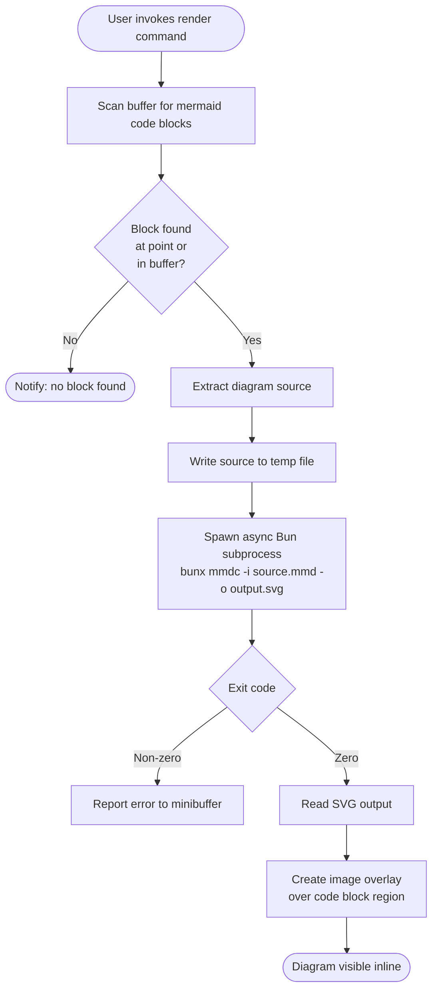

# Mermaid Inline Preview — Extension Specification

## Goal

Provide on-demand, inline rendering of Mermaid diagrams within Markdown buffers in
Emacs, displayed as image overlays directly over the source block, without requiring a
browser or Java runtime.

---

## Rationale

| Option | Runtime | Concern |
|---|---|---|
| Browser-based preview | JS engine in browser | Large attack surface; browser sandbox escapes; automatic execution on file open |
| PlantUML inline rendering | JVM | Heavy runtime; slow cold start; less active development |
| Mermaid via Bun sidecar | Bun subprocess | Fast startup; narrow attack surface; explicit opt-in execution; active upstream |

Rendering is always **explicit and user-initiated**. Diagram source is never executed
automatically on file open or buffer load. The Bun subprocess has no network access
during rendering and exits after producing output.

---

## Constraints

- No browser involvement at any stage of rendering
- Bun is the sole JavaScript runtime; Node.js is not required
- Rendering is opt-in only — never triggered automatically on file open or save
- The subprocess must run asynchronously so editing is never blocked
- Mermaid CLI is pinned to a specific version via `package.json`; no floating dependencies
- Rendered output is SVG, referenced via Emacs's librsvg integration for resolution independence
- No network access occurs during rendering; all assets are local
- The extension is a single self-contained `.el` file following repo conventions
- Temporary files are written to and cleaned up from the system temp directory

---

## Diagram

---

## Outline

### 1. Block Detection

Locate fenced code blocks tagged as `mermaid` within the current Markdown buffer.
Support two modes of scope: the block under point, and all blocks in the buffer.

### 2. Source Extraction

Extract the raw diagram source between the fence markers. Preserve whitespace exactly
as authored. Write the content to a uniquely named temporary file.

### 3. Subprocess Invocation

Invoke the Mermaid CLI via Bun asynchronously. Pass the temporary input file and a
corresponding output path. Capture stdout and stderr separately. The process must not
inherit any environment variables that could cause network access or shell expansion.

### 4. Output Handling

On successful exit, read the SVG file from disk. On failure, surface the stderr output
to the user via the minibuffer. Clean up temporary files in both cases.

### 5. Overlay Management

Create a buffer overlay spanning the code block region. Attach the rendered SVG as an
inline image to the overlay. Provide a command to remove all active overlays and restore
the raw source view. Overlays are not persisted across Emacs sessions.

### 6. Commands and Keybindings

Expose two user-facing commands:

- **Render block at point** — renders the single Mermaid block under the cursor
- **Render all blocks** — renders every Mermaid block in the buffer sequentially

Keybindings are defined locally within `markdown-mode` and do not pollute the global
keymap.

### 7. Configuration

Expose a small set of customisation variables:

- Path to the Bun executable (default: resolved from `PATH`)
- Path to the `package.json`-local `mmdc` binary
- Output format (SVG default; PNG as fallback for environments without librsvg)
- Maximum diagram render timeout
